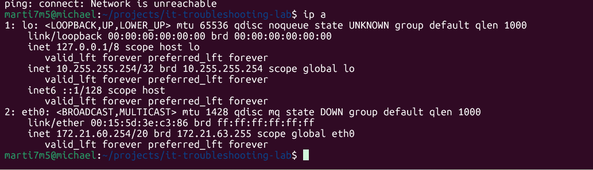
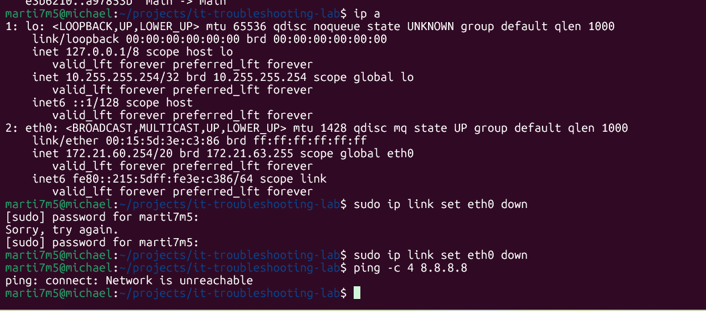
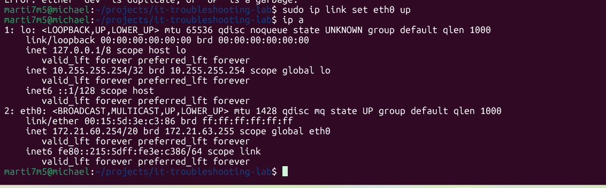
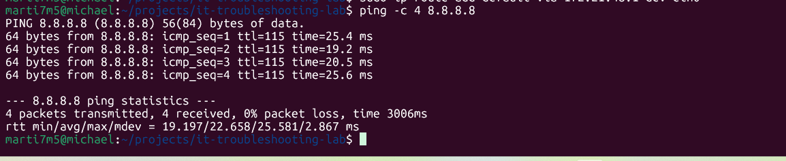

# IT Troubleshooting Lab

Hands-on lab simulating real-world IT support scenarios including network, DNS, service, and system issues.

---

## Scenario 1: Network Connectivity Failure

### 🧠 Problem
System was unable to reach external networks. Ping attempts to external IP addresses failed.

---

### 🔍 Diagnosis
- Tested connectivity using:
  ```bash
  ping -c 4 8.8.8.8# it-troubleshooting-lab
Hands-on IT troubleshooting lab simulating real-world network, DNS, service, and system issues in a Linux environment.

### 📸 Evidence





